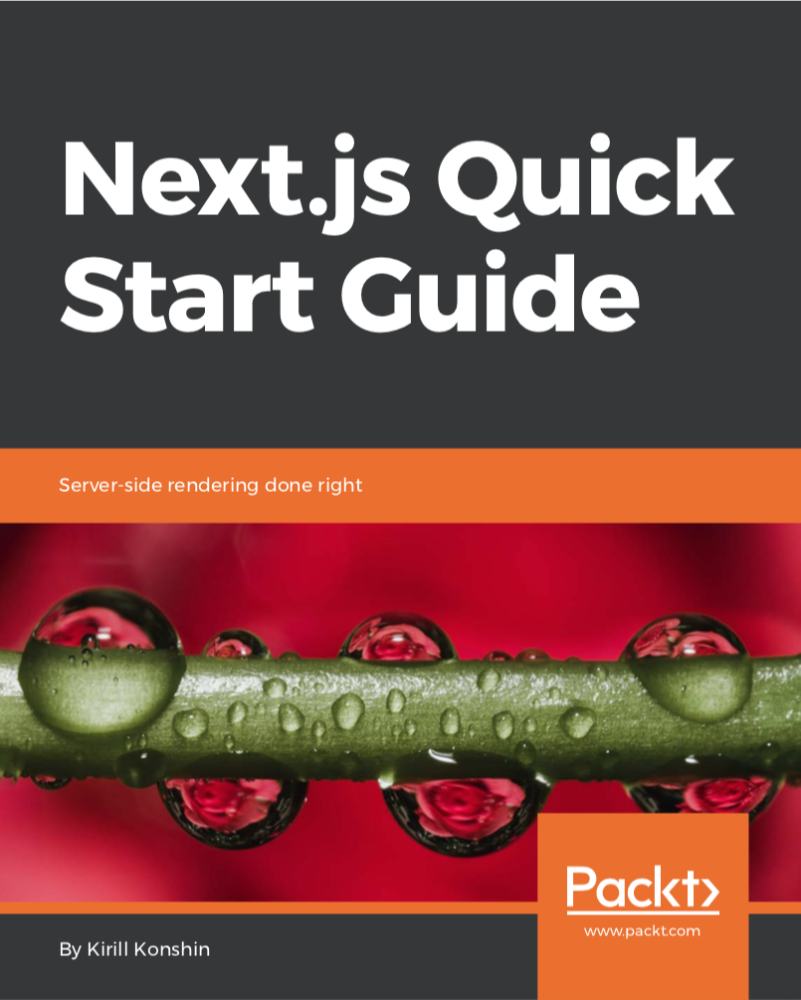

Next.js Quick Start Guide: Server-side rendering done right
===========================================================

This repository has all the code examples from the book.

Repository is organized as regular Lerna monorepo. You can use individual examples by doing `$ npm install` in
inidvidual folders or do centralized install in root and Lerna will take care of the rest.